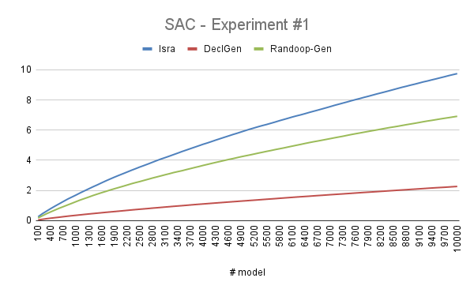
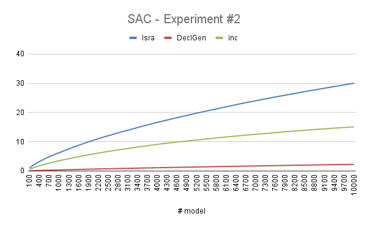

# Isra: Effective Random Test Generation for Deep Learning Compilers

Source code and other supplemental materials  for "Isra: Effective Random Test Generation for Deep
Learning Compilers". 


## Requirements

- Python 3

Our project depends on following python library, you could install them in Python 3 by `pip install -r requirements.txt`

- numpy
- onnx
- onnxruntime
- netron
- xlwt

(optional) To test DL compilers, you need to further install following compilers in your environment.

For the installation of **TVM**, please see [here](https://github.com/apache/tvm). 

For the installation of **Glow**, please see [here](https://github.com/pytorch/glow).

## Usage

#### Test Generation

```bash
# for Isra generation
python g.py --minnode %d --maxnode %d --pickrate %s --seed %d --loop %d --case %s
# experiment for pickrate: (loop is from 1 to 5)
# eg: python g.py --minnode 100 --maxnode 100 --pickrate 0.97 --case pickrate --seed 100 --loop 1"
# experiment for baseline: (loop is from 1 to 5)
# eg: python g.py --minnode 1 --maxnode 30 --pickrate 0.97 --case baseline --seed 100 --loop 1

# for baseline 1 Declarative-style generation 
python g_ran.py --minnode %d --maxnode %d --pickrate %s --seed %d --loop %d --case %s
# experiment for baseline: (loop is from 1 to 5)
# eg: python g_ran.py --minnode 1 --maxnode 30 --pickrate 0.97 --case baseline --seed 100 --loop 1

# for baseline 2 Randoop-like generation
python g_inc.py --minnode %d --maxnode %d --pickrate %s --seed %d --loop %d --case %s
# experiment for baseline: (loop is from 1 to 5)
# eg: python g_inc.py --minnode 1 --maxnode 30 --pickrate 0.97 --case baseline --seed 100 --loop 1 


```
#### Coverage measurement

```bash

# calculate the metrics
python getmetric.py --minnode %d --maxnode %d --pickrate %s --type %s --case %s --loop %d --start %d --end %d
# experiment for pickrate:
# eg: python getmetric.py --minnode 100 --maxnode 100 --pickrate 0.97 --type dice --case pickrate --loop 1 --start 1 --end 10000
# experiment for baseline: type in ['dice', 'rand', 'inc']
# eg: python getmetric.py --minnode 100 --maxnode 100 --pickrate 0.97 --type rand --case baseline --loop 1 --start 1 --end 10000

# for baseline Muffin
(1) python getops.py --start %d --end %d --dir dir_to_muffin_onnx_models
(2) python g2.py --pickrate %s --seed %d
(3) python getmuffinmetric.py --pickrate %s --dir dir_to_muffin_onnx_models

# write the results into excels 
# results of experiment for pickrate
python table.py --interval model_interval --total total_model --type pickrate --minnode %d --maxnode %d 
#eg: python table.py --interval 250 --total 10000 --type pickrate --minnode 100 --maxnode 100 

# results of experiment for baseline
python table.py --interval model_interval --total total_model --type baseline --minnode %d --maxnode %d --pickrate %s
#eg: python table.py --interval 250 --total 10000 --type baseline --minnode 1 --maxnode 30 --pickrate 0.97
# results of experiment for baseline Muffin
python table.py --interval model_interval --total total_model --type muffin --pickrate %s
# eg: python table.py --interval 250 --total 10000 --type muffin --pickrate 0.97

```

#### Bug Detection 

By feeding generated models, as well as random input data for models, into compilers,  we can test various compilers, including TVM, Glow and AnonymousX. Let's take TVM as an example.

```bash
# install TVM-v0.7
# export TVM_HOME=/path/to/tvm-0.7 && export PYTHONPATH=$TVM_HOME/python:${PYTHONPATH} 
python tvm_detecter.py --minnode 1 --maxnode 10 --times 300
# Then check with the folder named res_genmodel-g-tmp
```

For Glow and AnonymousX, we run the bug detection with compiler's command line interfaces.

#### Settings

Detailed settings are in `settings.py`. 


## Semantic Specification of Deep Learning Models

In deep learning, a computation graph is defined as a directed graph that comprises nodes and edges. Each node denotes a mathematical operation. Each edge describes a tensor that gets transferred between nodes. Computation graph is a suitable level of representation for deep learning model, considering that APIs are too high-level and hardware languages are too low-level.

Nodes on computation graph define mathematical operations on their related edges which are the input and output tensor(s) of the operation. Explicit forms of arithmetical expression of operations indicate the semantic specification of the operation (i.e., the constraints between the attributes of tensors).

In order to better model those constraints from operations, we categorize the operations into three types and describe their features respectively, as shown in the table below. Some of the operations may belong to more than one category. 

| Number | Operation Name  |               Type               |                          Parameters                          |
| :----: | :-------------: | :------------------------------: | :----------------------------------------------------------: |
|   1    |    Identity     |            *identity*            |                             None                             |
|   2    |       Abs       |            *identity*            |                             None                             |
|   3    |       Neg       |            *identity*            |                             None                             |
|   4    |   Reciprocal    |            *identity*            |                             None                             |
|   5    |      Floor      |            *identity*            |                             None                             |
|   6    |      Ceil       |            *identity*            |                             None                             |
|   7    |      Round      |            *identity*            |                             None                             |
|   8    |       Erf       |            *identity*            |                             None                             |
|   9    |      Sign       |            *identity*            |                             None                             |
|   10   |       Exp       |            *identity*            |                             None                             |
|   11   |    Softsign     |            *identity*            |                             None                             |
|   12   |     Softmax     |            *identity*            |                             axis                             |
|   13   |     Sigmoid     |            *identity*            |                             None                             |
|   14   |   HardSigmoid   |            *identity*            |                         alpha, beta                          |
|   15   |      Relu       |            *identity*            |                             None                             |
|   16   |    LeakyRelu    |            *identity*            |                            alpha                             |
|   17   |      Selu       |            *identity*            |                         alpha, gamma                         |
|   18   |       Sin       |            *identity*            |                             None                             |
|   19   |       Cos       |            *identity*            |                             None                             |
|   20   |      Sqrt       |            *identity*            |                             None                             |
|   21   |      PRelu      |          *multi-inputs*          |                             None                             |
|   22   |     Flatten     |          *multi-inputs*          |                             axis                             |
|   23   |       Add       |          *multi-inputs*          |                             None                             |
|   24   |       Sub       |          *multi-inputs*          |                             None                             |
|   25   |       Mul       |          *multi-inputs*          |                             None                             |
|   26   |       Div       |          *multi-inputs*          |                             None                             |
|   27   |       Sum       |          *multi-inputs*          |                             None                             |
|   28   |       Max       |          *multi-inputs*          |                             None                             |
|   29   |       Min       |          *multi-inputs*          |                             None                             |
|   30   |      Mean       |          *multi-inputs*          |                             None                             |
|   31   |     MaxPool     |          *multi-inputs*          | auto\_pad, ceil\_mode, dilations, kernel\_shape, pads, storage\_order, strides |
|   32   |   AveragePool   |          *multi-inputs*          | auto\_pad, ceil\_mode, count\_include\_pad, dilations, kernel\_shape, pads, strides |
|   33   |     LpPool      |          *multi-inputs*          |          auto\_pad, kernel\_shape, p, pads, strides          |
|   34   |      Conv       |          *multi-inputs*          |  auto\_pad, dilations, group, kernel\_shape, pads, strides   |
|   35   |     MatMul      |          *multi-inputs*          |                             None                             |
|   36   |      Gemm       |          *multi-inputs*          |                 alpha, beta, transA, transB                  |
|   37   |     Concat      | *multi-inputs*, *shape-changing* |                             axis                             |
|   38   |  SpaceToDepth   |         *shape-changing*         |                       blocksize, mode                        |
|   39   |    ReduceMax    |         *shape-changing*         |                        axes, keepdims                        |
|   40   |   ReduceMean    |         *shape-changing*         |                        axes, keepdims                        |
|   41   |    ReduceMin    |         *shape-changing*         |                        axes, keepdims                        |
|   42   |   ReduceProd    |         *shape-changing*         |                        axes, keepdims                        |
|   43   | ReduceSumSquare |         *shape-changing*         |                        axes, keepdims                        |
|   44   |    ReduceL1     |         *shape-changing*         |                        axes, keepdims                        |
|   45   |    ReduceL2     |         *shape-changing*         |                        axes, keepdims                        |
|   46   | ReduceLogSumExp |         *shape-changing*         |                        axes, keepdims                        |
|   47   | Tile               | *multi-inputs*, *shape-changing* | None                                                    |
|   48   | Gather             | *multi-inputs*, *shape-changing* | axis                                                    |
|   49   | Compress           | *multi-inputs*, *shape-changing* | axis                                                    |
|   50   | Split              | *multi-inputs*, *shape-changing* | axis                                                    |
|   51   | Expand             | *multi-inputs*, *shape-changing* | axis                                                    |
|   52   | Tanh               | *identity*                       | None                                                    |
|   53   | ThresholdedRelu    | *identity*                       | alpha                                                   |
|   54   | Softplus           | *identity*                       | alpha                                                   |
|   55   | Pad                | *multi-inputs*, *shape-changing* |        mode                                            |
|   56   | Slice              | *multi-inputs*, *shape-changing* |                None                                |
|   57   | GlobalAveragePool  | *shape-changing*                 |                                  None                       |
|   58   | ReduceSum          | *multi-inputs*, *shape-changing* |    keepdims, noop_with_empty_axes                        |
|   59   | Transpose          | *shape-changing*                 | perm                                                    |
|   60   | Unsqueeze          | *multi-inputs*, *shape-changing* |                                         None      |
|   61   | BatchNormalization | multi-inputs                     |                      epsilon, momentum, training_mode                            |
|   62   | Reshape            | *multi-inputs*, *shape-changing* |                                       allowzero                  |
|   63   | GlobalMaxPool      | *shape-changing*                 |                          None                         |
|   64   | Resize             | *shape-changing*                 |                  antialias, axes, cubic_coeff_a, coordinate_transformation_mode, mode, exclude_outside, extrapolation_value, keep_aspect_ratio_policy, nearest_mode          |
|   65   | Elu                | *identity*                       | alpha                                                   |


The first type is called *identity* operation (e.g., `Absolute` operation, `Exponential` operation). It means that the shape of the input tensor is the same as the shape of the output tensor. For example, `Softmax` operation will take a single tensor and an integer parameter as the input. The integer parameter is named  which defines the dimension that `Softmax` operation will be performed on. 

The second type is *multi-inputs* operation (e.g., `Add` operation, `Sub` operation). It means that the input of the operation requires multiple tensors. For example, `Add` operation takes two or more tensors as input and performs element-wise binary addition with them. We use  to denote the length of i-th dimension in tensor , and take two tensors as the input as the example:


The mathematic expression of addition naturally implies a semantic constraint between the inputs: the shape of tensor , , and  should be same () denotes the dimension of tensor ):


=dim(B)=dim(C)) and ]})


The third type is *shape-changing* operations (e.g., `ReduceMax` operation, `Pooling` operation, `Conv` operation. The shape of output tensors will change along with input tensors. Take the `Concat` operation as an example, it takes a list of tensors into a single tensor with a parameter axis that defines the dimension to concatenate on (also take two tensors as input as the example):


The specification of `Concat` operation is as follows: all input tensors will have the same shape, except for the length of axis-th dimension; and for the axis-th dimension which input tensors concatenate on, the output tensor's length of that dimension will equal to the sum of input tensors':


=dim(B)=dim(C))


]},{i\neq{axis}})


## Metrics

To better present the efficiency of our generated models, we draw different metrics to measure our performance. We design 11 types of metrics in total. It contains two parts: graph-level metrics and operation-level metrics. We put forward graph-level metrics ourselves by analogy concepts in structural code coverage and combinatorial test. For operation-level metrics, we mainly follow the work by [Luo etc.](https://arxiv.org/pdf/2008.05933.pdf) They are listed below:

- **Graph-level Metrics**
  
  Let a **test set** be the set of models generated by an approach. Given a test set , which contains  graphs, the graph-level metrics are defined as follows. 
  
  - **Number of Operations (NOO)**, **Number of Operation Types (NOT)**, **Number of Operation Pairs (NOP)**, **Number of Operation Triples (NTR)**, **Number of Shapes and Attributes (NSA)**. We put these metrics together because they all represent the diversity of a computation graph. 
  The NOO of a graph  is defined as the total number of operations in . 
  The NOT of a graph  is defined as the number of different types of operations in . 
  The NOP of a graph  is defined as the number of different edges in  that connect two operations together. 
  The NTR  of a graph  is defined as the number of different pairs of adjacent edges that connect three operations together in . 
  The NSA of a graph  is defined as the total number of different shapes of input tensors and attributes (except for input degrees) for each operation in graph . 
  These metrics for test set   are defined as the average of each of them of all the graphs in  : =\frac{\Sigma_g{NXX_g(g)}}{n_I}), where .

- **Operation-level Metrics**
  
  An **operation corpus** is a set of operations with their attributes including the operation name and the possible number of different input degrees. Given an operation corpus  containing  different operations and a test set , 
  we first give the definition of each metric on an operator  in , denoted as ), and the operation-level metric of  is defined as the average of the metric on different operators, i.e., =\frac{\Sigma_o{XXC_{op}(o)}}{n_C}), where .
  
  - **Operation Type Coverage (OTC)** shows the diversity of operations in the test set . Let ) be 1 if operation  appears in , and 0 otherwise.
  - **Input Degree Coverage (IDC)** shows the diversity of the input degrees of the operations in the test set. For each operation  in , let ) and ) be the number of different input degrees of  in  and in  respectively, we have the IDC of the operation  as the ratio of ) and ): =\frac{n_{id}(o,I)}{n_{id}(o,C)}). 
    For operations that have infinite numbers of input degrees  (e.g. `Max`), we set an upper bound for their ).
  - **Output Degree Coverage (ODC)** shows the diversity of output degrees of operations in . The ) is defined as the number of different output degrees of  in . 
  - **Single Edge Coverage (SEC)** shows the diversity of edges between the operations in . Let ) be the number of different edges directed from the operation  in . Supposing that each operation could be connected with all operations in ,  we define the SEC of  as the ratio of ) and : =\frac{n_e(o,I)}{n_C}). 
  - **Double Edge Coverage (DEC)** shows the diversity of pairs of edges that are adjacent, which is actually the coverage of different triples of operations that are connected in a graph in the test set. Let ) be the number of different pairs of edges () where  is directed from the operation  and  is adjacent to  in some graph in .
  The DEC of  is the ratio of ) and : =\frac{n_p(o,I)}{{n_C}^2}). 
  - **Shapes and Attributes Coverage (SAC)** indicates the diversity of input and output tensor shapes of the operations in the test set. The ) is defined as the number of different input tensor shapes and attributes (except for input degrees) of  in . 

## Experiments and Results

We conducted 3 experiments to evaluate the coverage of Isra, comparing with three baselines including a state-of-the-art approach Muffin. Also, we run 1 experiment to compare the results of different values of the parameter *pickRate*. 

**Baselines**: 

The first baseline is declarative-style generation, called **'DeclGen'**, whose relative results have a name of **'rand'**. It relies on the compiler’s running to check whether it is satisfied with semantic specifications of deep learning model only after the construction of a whole model. 

The second baseline is Randoop-like generation, called **'Randoop-Gen'**, which conducts random generation for operation construction, i.e., randomly constructs a new operation to append it into the model, and checks whether the model satisfies the semantic specifications or not. It relative results have a name of **'inc'**.

The last baseline is a state-of-the-art approach called Muffin ([Gu etc.](https://arxiv.org/abs/2204.08734.pdf)).

The results of **Isra** have a name of **'dice'**.

**Common Settings**: 

For the experiment on coverage measurement, we run each approach to generate a fixed number of models, as 10000. For Isra, we set the upper bound on the tensor dimension as 5, and the upper bound on the length of each dimension as 5. We set the parameter *pickRate* as 0.97 based on our sensitivity experiments, as shown in experiment #4. We set the maximum input degree and output degree of an operation as 5 and 12, respectively.

To eliminate randomness, We run our approach and baselines separately for five times and calculate the average number. 

We measure the results based on the metrics we raised. 

### #1. Generate a fixed number of models of multiple sizes `[1-30]`, compared with baselines DeclGen and Randoop-Gen

**settings**: In experiment #1, we compare the coverage of Isra with DeclGen and Randoop-Gen. We choose the lowerbound of operation number as 1, upperbound of operation number as 30.

#### results:

The results of metrics of Isra and other 2 baselines are presented in the table below:

|            |   **Isra**  | **DeclGen** | **Randoop-Gen** |
|:----------:|:-----------:|:-----------:|:---------------:|
| **time/s** |   **19.38** |    330.2657 |        194.5023 |
|            |             |             |                 |
|   **OTC**  |    **100%** |     97.844% |         97.536% |
|   **IDC**  |  **92.95%** |     90.332% |         89.472% |
|   **ODC**  |    **8.79** |        4.91 |           7.568 |
|   **SEC**  | **98.262%** |     68.246% |          80.54% |
|   **DEC**  | **25.276%** |      2.102% |          18.86% |
|   **SAC**  | **974.144** |     226.856 |         691.566 |
|            |             |             |                 |
|   **NOO**  |     15.4321 |      2.8783 |     **15.4505** |
|   **NOT**  | **13.3626** |      2.7612 |         12.2484 |
|   **NOP**  |     12.6837 |      1.4873 |     **13.6511** |
|   **NTR**  |      8.4232 |      0.5979 |     **10.3643** |
|   **NSA**  |  **7.6405** |      1.5468 |          3.2252 |

We also present figures of the increase of operation-level metrics over the number of models. 




The distributions of different operators in Isra and two baselines are shown in the following fig:


### #2. Generate a fixed number of models of multiple sizes `[1-200]`, compared with baselines DeclGen and Randoop-Gen.

**settings**: In experiment #2, we compare the coverage of Isra with DeclGen and Randoop-Gen. We choose the lowerbound of operation number as 1, upperbound of operation number as 200.

The results of metrics of Isra and other 2 baselines are presented in the table below:

|            |   **Isra**   | **DeclGen** | **Randoop-Gen** |
|:----------:|:------------:|:-----------:|:---------------:|
| **time/s** | **320.1713** |   9011.9172 |       4721.8233 |
|            |              |             |                 |
|   **OTC**  |     **100%** |     97.536% |          98.46% |
|   **IDC**  |   **92.95%** |     90.178% |         89.966% |
|   **ODC**  |   **11.848** |       4.928 |          10.616 |
|   **SEC**  |   **98.27%** |     67.804% |          88.08% |  **98.15%** |      35.49% |
|   **DEC**  |       45.324% |   **57.7%** |       4.95% |
|   **SAC**  | **3001.938** |     227.018 |        1509.356 |
|            |              |             |                 |
|   **NOO**  | **100.8766** |      2.8783 |        100.1231 |
|   **NOT**  |   **45.237** |        2.76 |         33.0021 |
|   **NOP**  | **103.7621** |      1.4856 |         98.6460 |
|   **NTR**  |     102.9130 |      0.6042 |    **105.5774** |
|   **NSA**  |  **26.6252** |      1.5533 |         10.0211 |

We also present figures of the increase of operation-level metrics over the number of models. 




The distributions of different operators in Isra and two baselines are shown in the following fig:


### #3. Generate a fixed number of models of same sizes, compared with Muffin.

**settings**: In experiment #3, we compare the coverage of Isra and Muffin. For Muffin, it contains 4 generation modes in their implementation. We randomly choose the modes with the same probability. For other parameters, we obey its default settings.
For alignment with comparsion on coverage metrics, we convert the Keras models generated by Muffin to ONNX format with TF2ONNX. Because Keras API is more higher level than ONNX, the converting leads to the growth of model size. For fairness, in the experiment on coverage measurement, for
every model Muffin generated, we adopt Isra to generate a model with the number of operations same as Muffin, named Isra*. Also, we ensure that both approaches have a same operation set (of size 36, which is the number of overlapped operations).

The results of metrics of Isra* and Muffin are presented in the table below:

|            |  **Isra***  |  **Muffin** |
|:----------:|:-----------:|:-----------:|
| **time/s** | **20.1031** |  25847.6804 |
|            |             |             |
|   **OTC**  |    **100%** |        100% |
|   **IDC**  |  **91.85%** |      88.52% |
|   **ODC**  |    **8.75** |        4.22 |
|   **SEC**  |  **98.15%** |      35.49% |
|   **DEC**  |   **57.7%** |       4.95% |
|   **SAC**  | **1192.22** |      556.44 |
|            |             |             |
|   **NOO**  | **10.4236** | **10.4236** |
|   **NOT**  |  **8.6589** |      5.3289 |
|   **NOP**  |  **7.8243** |       6.399 |
|   **NTR**  |      4.6481 |  **6.0766** |
|   **NSA**  |      5.9253 | **11.3604** |

The distributions of different operators in Isra and Muffin are shown in the following fig:


### #4. Generate a fixed number of models of fixed size, with different settings of *pickRate*

**settings**: In experiment #4, we compare the coverage of Isra under different setting of *pickRate* . The model size is fixed as 100, and we keep other settings unchanged. The values of *pickRate* are `[0.5, 0.8, 0.9, 0.95, 0.96, 0.97, 0.98, 0.99]`.

#### results:

The results of metrics of different *pickRate* values are presented in the table below:

| Picking Rate |   **0.5**    |   **0.8**    |   **0.9**    |  **0.95**  |  **0.96**  |  **0.97**  |  **0.98**  |   **0.99**    |
| :----------: | :----------: | :----------: | :----------: | :--------: | :--------: | :--------: | :--------: | :-----------: |
|   **time**   | **215.2858** |   260.4653   |   269.9829   |  270.0106  |  268.0957  |  267.2378  |  266.047   |   266.3605    |
|              |              |              |              |            |            |            |            |               |
|   **OTC**    |   **100%**   |   **100%**   |   **100%**   |  **100%**  |  **100%**  |  **100%**  |  **100%**  |   **100%**    |
|   **IDC**    |  **92.95%**  |  **92.95%**  |  **92.95%**  | **92.95%** | **92.95%** | **92.95%** | **92.95%** |  **92.95%**   |
|   **ODC**    |     8.46     |    11.018    |    11.608    |   11.75    |   11.766   |   11.786   |   11.784   |  **11.836**   |
|   **SEC**    |  **98.27%**  |  **98.27%**  |  **98.27%**  | **98.27%** | **98.27%** | **98.27%** | **98.27%** |  **98.27%**   |
|   **DEC**    |   54.566%    |    83.44%    |   87.806%    |   89.24%   |  89.456%   |  89.668%   |   89.84%   |  **90.042%**  |
|   **SPC**    |   3152.53    | **3168.516** |   3099.232   |  3031.676  |  3020.32   |  3011.63   |  2973.578  |   2968.824    |
|              |              |              |              |            |            |            |            |               |
|   **NOO**    |   **100**    |   **100**    |   **100**    |  **100**   |  **100**   |  **100**   |  **100**   |    **100**    |
|   **NOT**    |     51.2     |   51.21002   | **51.23842** |  51.2124   |  51.2048   |  51.21956  |  51.21226  |    51.2081    |
|   **NOP**    |   51.06744   |   82.9076    |   94.33816   |  100.1718  | 101.33792  | 102.55626  | 103.76544  | **104.94422** |
|   **NTR**    |   23.7335    |   63.98712   |   83.30116   |  94.19208  |  96.40912  |  98.77044  | 101.15406  | **103.56684** |
|   **NSP**    | **62.86254** |   42.04568   |   33.84228   |  29.54448  |  28.61842  |  27.76688  |  26.81846  |   25.93236    |


## Bug Details

Bug details are shown in bugs.xlsx and bugs folder.

We provide with reproducible packages for all of bugs that each approach detected, including the buggy models, inputs, and error messages. We will also release URLs of bug issues we reported in the community after anonymous reviewing. The bugs in the folder `bugs` are arranged as follows: `bugs/COMPILER_NAME/APPROACH_NAME`.


